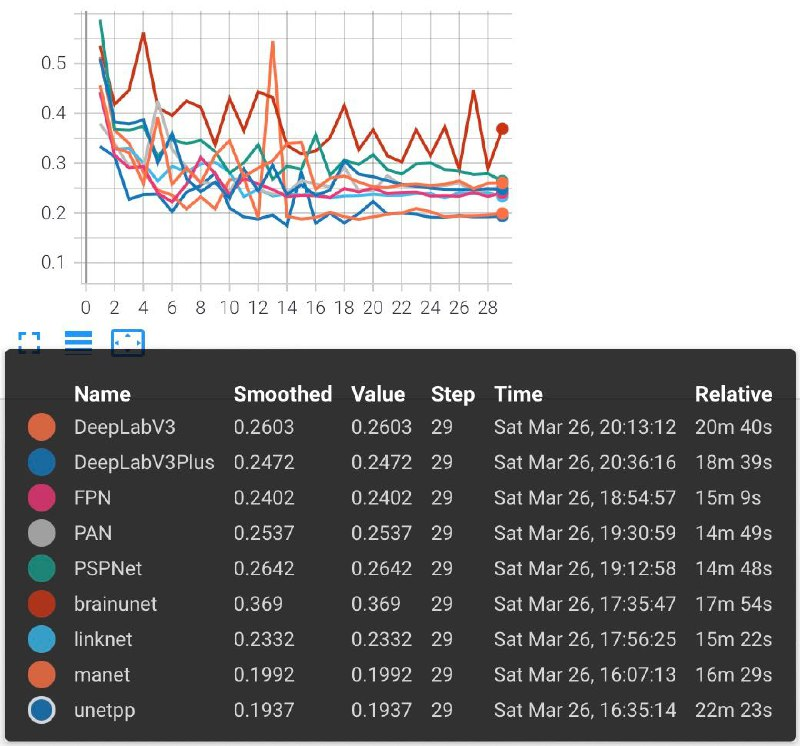

# Colorectal cancer cells segmentation on histological images

Colorectal cancer is one of the three most common types of cancer in the world. Histological and immunohistochemical examination of the tumor tissue taken with the help of a biopsy is the standard for making a diagnosis and choosing the correct treatment plan.

Based on a dataset of histological images of malignant neoplasms of the colon, rectosigmoid and rectum, a semantic segmentation model was developed that is able to separate and label healthy/cancerous tissues.

## Run pipeline & tensorboard
~~~
python src/main.py config.txt
tensorboard --logdir runs
~~~

